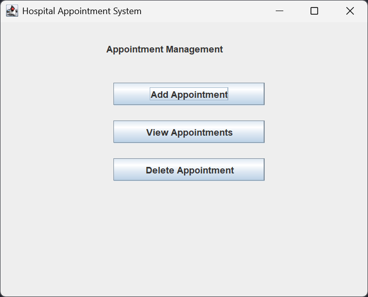
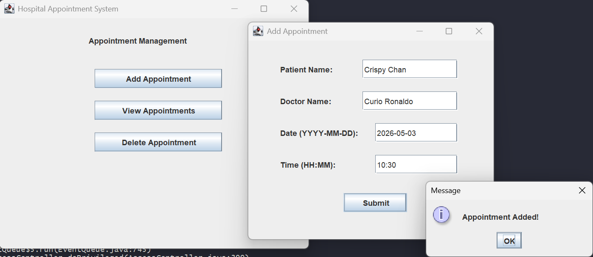
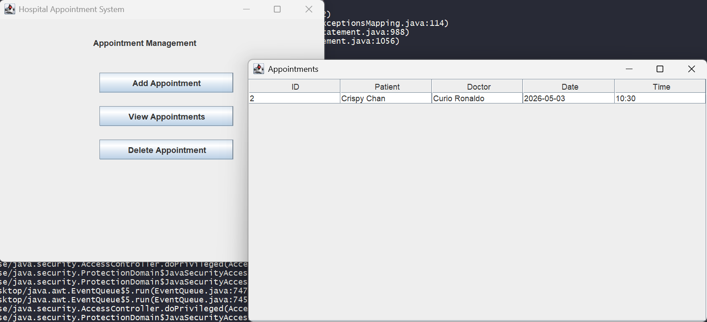
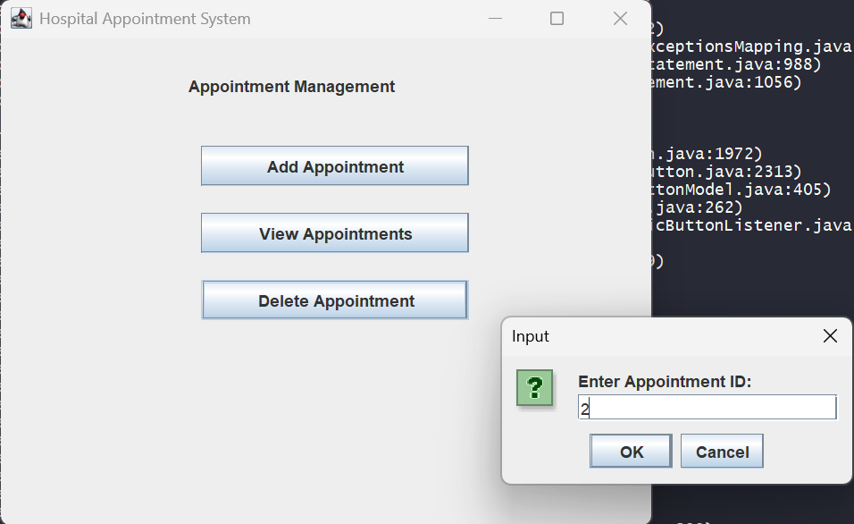
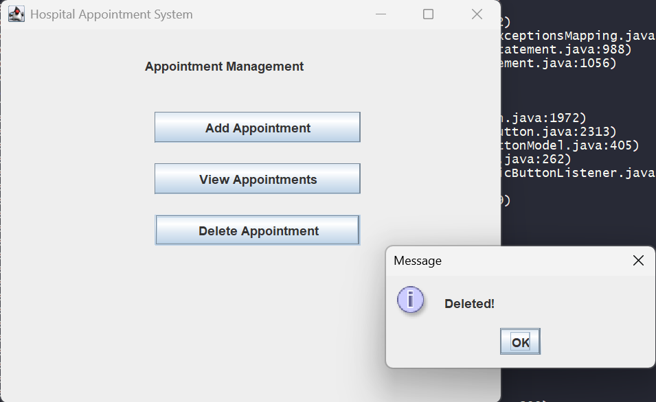
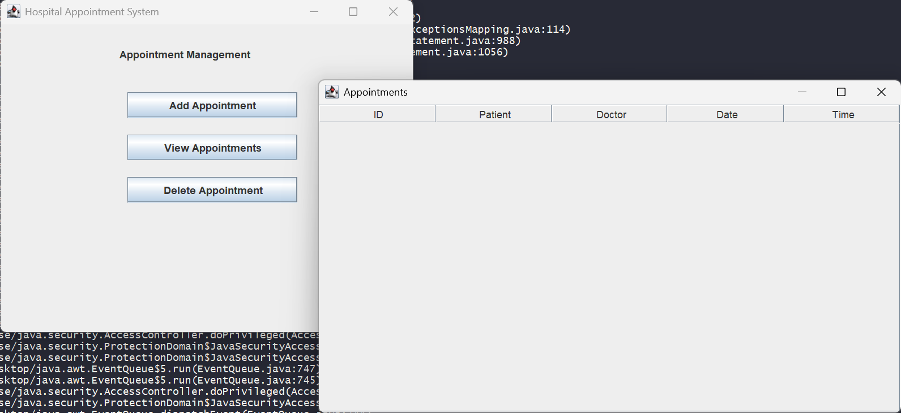

# Hospital Appointment Management System

A desktop-based **Hospital Appointment Management System** built using **Java Swing**, **JDBC**, and **MySQL**.
The application provides a simple graphical interface to manage patient appointments efficiently while following a clean layered architecture.

---

## Features

* Add new appointments through GUI
* View all appointments in a table (JTable)
* Delete appointments by ID
* Fetch appointment details by ID *(backend ready)*
* Update appointment information *(backend ready)*
* Input validation through service layer

---

## Tech Stack

* Java (Swing)
* JDBC
* MySQL
* SQL

---

## Project Structure

```
Hospital-Appointment-System/
│
├── src/
│   ├── dao/        → database interaction (JDBC)
│   ├── dto/        → appointment data model
│   ├── service/    → business logic & validation
│   ├── ui/         → Swing GUI
│   └── mysql-connector-j-9.x.x.jar
│
├── .gitignore
└── README.md
```

---

## Architecture Overview

The project follows a layered architecture to ensure clean separation of responsibilities:

* **DTO** – represents appointment data
* **DAO** – handles database queries using JDBC
* **Service** – applies validation and business rules
* **UI** – interacts with users through a graphical interface

---

## Database Setup

```sql
CREATE DATABASE rnsitdb;
USE rnsitdb;

CREATE TABLE appointments (
    id INT PRIMARY KEY AUTO_INCREMENT,
    patient_name VARCHAR(100),
    doctor_name VARCHAR(100),
    appointment_date VARCHAR(20),
    appointment_time VARCHAR(20)
);
```

---

## Running the Project

1. Ensure MySQL server is running
2. Update database credentials in:

   ```
   dao/AppointmentDAOImpl.java
   ```
3. Compile the project:

   ```bash
   javac -d . -cp src/mysql-connector-j-9.x.x.jar src/*/*.java
   ```
4. Run the application:

   ```bash
   java -cp ".;src/mysql-connector-j-9.x.x.jar" ui.AppointmentUI
   ```

---

## GUI Preview

<p align="center">
  
</p>

<p align="center">
  
</p>

<p align="center">
  
</p>

<p align="center">
  
</p>

<p align="center">
  
</p>

<p align="center">
  
</p>

---

## Future Improvements

* Complete update & search functionality in GUI
* Add doctor availability management
* Improve UI layout using layout managers
* Add authentication system
* Appointment scheduling with conflict handling

---

## What I Learned

* Designing applications using layered architecture
* Integrating Java Swing with MySQL via JDBC
* Managing structured data using SQL
* Building user interfaces for desktop applications

---

## Author

Shreyanka Das
